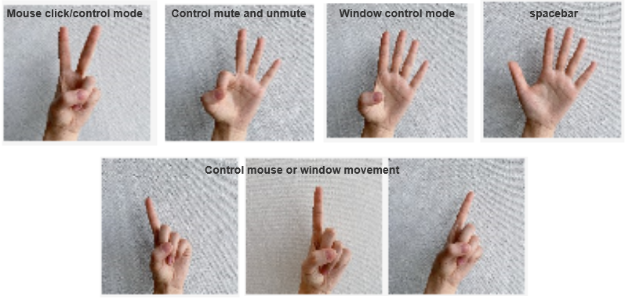

# User Manual

| :------------------------------------------------------------------------------------------------------------------------------------------- |
| **IMPORTANT:** When using Gestro, no other body parts except for the gesture performing hand of the user should be within the yellow region so that hand gestures can be detected correctly. |
| It is recommended to use Gestro in a location with a stable camera which the background has a sufficiently different colour than your skin colour for optimum experience. |

## Getting Started
If you haven't done so, install Gestro following the instructions from our [installation guide](installation_guide).

## Launching Gestro
Firstly, launch a terminal and enter the following commands to cd into the Gestro's bin directory:
```sh
cd ~/Gestro/bin
```

### Main Program
Start the Gestro application by running the following commands:

```sh
./Gestro
```

## Main Menu

<div align="center">
    
</div>

After Gestro is successfully launched, users will be greeted with the main menu. At the main menu, there will be three buttons: _Start_, _Instructions_, and _About Us_, which starts using Gestro, shows instructions, and shows the about us page respectively.

## Main Program

<div align="center">
    
</div>

1. After launching Gestro (follow instructions from [Launching Gestro](Launching-Gestro)), click the _Start_ button from the main menu, where the main program then officially starts, displaying the main user interface to the user.
2. Move your gesture performing hand to cover the blue boxes located in the yellow region at the upper right, **only then** click the _Calibrate Skin_ button with your hands still covering the blue boxes.
3. If your hand can be clearly seen while in the yellow region, skip this step and go to step 4. Else, adjust the sliders in _Calibrate Values_.
4. Remove all body parts including your hands from the yellow region, and click _Calibrate Background_ or press "B" on your keyboard. **Note: ensure that there are no moving objects in the yellow region**
5. After step 4, make sure that the whole yellow region is entirely black and move the gesture performing hand back into the yellow region. If the hand can be clearly seen among the black background, move to the next step. Else, repeat step 4 again.
6. Select the functions that you would like to use from _Select Controls_
7. Click on _Detector_ and start performing gestures following the instructions image that is shown on the same page to execute the corresponding functions.

## Components of Main Program

<div align="center">
    
</div>

### 1. Feedback display

The first noticeable thing on the main user interface will be the feedback display where the selection of _Unprocessed Feed_ is selected by default.

- Unprocessed Feed - Displays to the user what is being captured from their webcam without going through any processing.

- Skin Mask - Displays the skin mask to the user, will be available and is selected automatically after clicking Calibrate Skin.

- Detector - Displays the finger detection to the user, will be available after clicking Calibrate Skin. **Note: _Detector_ have to be selected before any gestures can be detected by the program**

- Calibrate Skin - Calibrates the feed to detect the skin color of the user. **Note: The user has to first move their gesture performing hand to cover the blue boxes located in the yellow region at the upper right of _Unprocessed Feed_ before clicking Calibrate Skin_, adjust the sliders in _Calibrate Values_ if the user's hand cannot be clearly seen while in the yellow region.**

- Calibrate Background - Calibrates the feed to ignore the background of the user. **Note: Before clicking Calibrate Background, the user should remove all body parts including their hands from the yellow region at the upper right to avoid it being detected as background. Make sure that there are no moving objects in the yellow region as well.**

### 2. Select Functions
Here users will be able to select and deselect the functions that they would like to use through the corresponding checkboxes,

Here are the list of features which can be select or deselect:
* Enter Spacebar (used to control play or pause)
* Mute and Unmute.
* Minimise window.
* Move Window. (Use one finger to move the window after selecting the function)
* Move mouse and perform mouse clicks. (Use one finger to move the cursor after selecting the function)

### 3. Gesture Instructions
An image is shown to the user for them to learn the gestures to perform to use each of the functions.

<div align="center">
    
</div>

### 4. Calibrate Values
There are four trackbars which can be manually adjusted to make sure the hand detection is working as intended in cases where the _Calibrate Skin_ button does not give sufficient results.

### 5. Log
There is a log here which records details on the buttons that were selected on previously (Eg. Calibrate Skin, Skin Detector, etc).

## Instructions

<div align="center">
    
</div>

The button _Instructions_ from Main Menu shows the users instructions on how to use Gestro.

## About Us

<div align="center">
    
</div>

The last button _About Us_ in Main Menu brings up a page which introduces the team behind Gestro, along with the current version of Gestro.
